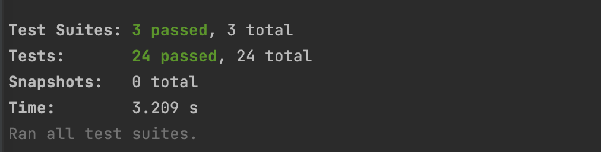

:doctype: book
:icons: font
:source-highlighter: highlightjs
:toc: left
:toclevels: 3
:sectlinks:

== 개요
* 프리랜서 채용 공고 서비스 개발

== 구현기능
=== 회원
* 회원가입 / 로그인
** 구글 OAuth 인증을 통해 회원가입 및 로그인 처리

=== 프리랜서
* 프리랜서 등록
** 로그인한 사용자가 자기소개, 커리어, 기술 정보를 추가로 입력하여 등록

* 프리랜서 목록 조회
** 검색어와 페이지 번호를 통해 검색하여 해당하는 프리랜서 목록을 조회
** 캐시에서 조회. 캐시에 데이터가 없을 경우에는 DB 에서 조회한 후 해당 데이터를 캐시에 저장

* 프리랜서 정보 상세 조회
** 프리랜서 id 를 입력받아 해당하는 프리랜서 정보를 상세 조회
** 캐시에서 조회. 캐시에 데이터가 없을 경우에는 DB 에서 조회한 후 해당 데이터를 캐시에 저장

== 테이블
=== 회원
* provider: 인증 Provider
* providerId : providerId
* name : 사용자 명
* email : 사용자 이메일

=== 프리랜서
* position : 담당 포지션
* aboutMe : 자기소개
* career : 커리어 소개
* skills : 기술 소개

== API
=== 회원
- 구글 OAuth2 인증
|===
|Method|URL|Response
|GET
|/auth/google
|구글 로그인 페이지 리다이렉트
|===

=== 프리랜서
- 프리랜서 등록
|===
|Method|URL|Request Body|Response
|POST
|/api/freelancers
|aboutMe : 자기소개 +
career : 커리어
skills : 기술
position : 직무 포지션
|status : 201
|===

- 프리랜서 목록 조회
|===
|Method|URL|Request Param|Response
|GET
|/api/freelancers
|keyword : 검색어 +
page : 페이지 번호
|status : 200 +
{ +
&nbsp;&nbsp;username : 이름 +
&nbsp;&nbsp;position : 직무 포지션 +
} []
|===

- 프리랜서 상세 조회
|===
|Method|URL|Request Path|Response
|GET
|/api/freelancers/:id
|id : 프리랜서 ID
|status : 200 +
{ +
&nbsp;&nbsp;username : 이름 +
&nbsp;&nbsp;email : 이메일 +
&nbsp;&nbsp;position : 직무 포지션 +
&nbsp;&nbsp;aboutMe : 자기소개 +
&nbsp;&nbsp;career : 커리어 +
&nbsp;&nbsp;skills : 기술 +
}
|===

== 테스트
* link:https://github.com/Ruby-Toys/freelancerApp/blob/develop/test/domain/freelancer/freelancer.repository.spec.ts[조회 쿼리 단위 테스트]
* link:https://github.com/Ruby-Toys/freelancerApp/blob/develop/test/domain/freelancer/freelancer.cache.spec.ts[캐시 조회 테스트]
* link:https://github.com/Ruby-Toys/freelancerApp/blob/develop/test/domain/freelancer/freelancer.controller.spec.ts[통합 테스트]

=== 테스트 전체 실행 결과

