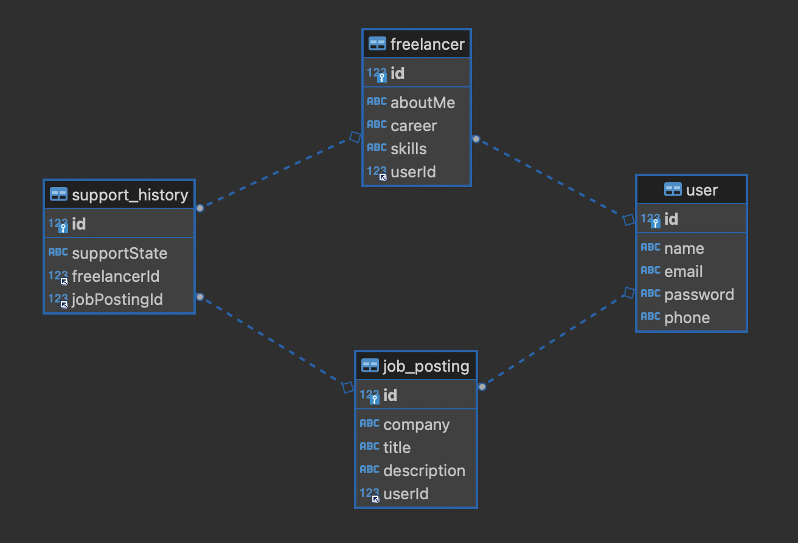

== 개요
* 프리랜서 채용 공고 서비스 개발

== 구현기능
* 회원
    ** 회원가입
    ** 로그인

* 프리랜서
    ** 프리랜서 등록
    ** 프리랜서 목록 조회
    ** 프리랜서 정보 상세 조회
    ** 프리랜서 상태 변경
    ** 프리랜서 정보 삭제
    ** 프리랜서 제안
        *** 모집 공고를 올린 담당자가 해당 공고 참여에 제안
        *** 회원이 제안을 수락하면 지원 이력에 협의중 상태로 등록

* 모집 공고
    ** 모집 공고 등록
    ** 모집 공고 목록 조회
    ** 모집 공고 상세 조회
    ** 모집 공고 상태 변경
    ** 모집 공고 삭제

* 지원 이력
    ** 모집 공고 지원 이력 등록
    ** 모집 공고 지원 취소
    ** 모집 공고 목록 조회
    ** 모집 공고에 지원한 프리랜서 목록 확인
    ** 지원한 모집공고 목록 조회
    ** 모집 공고 지원 (제안, 지원, 협의, 합격, 탈락) 여부 변경

== ER Diagram
